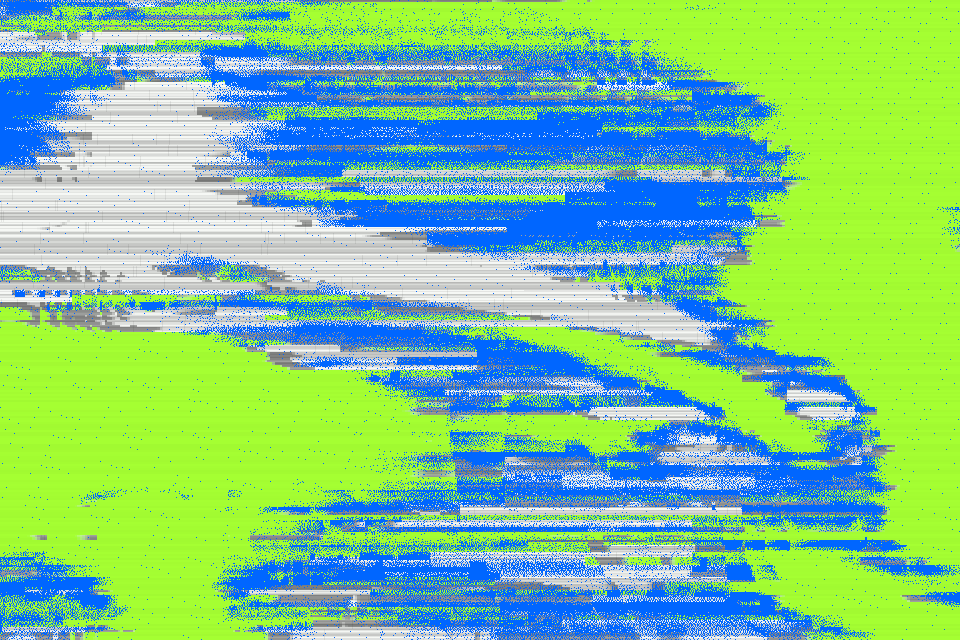

# Dithr

**[Open the studio →](https://dithr.vaporware.gripe)**

A free tool for making animated pixel art backgrounds. Roll a shader, tune it until it's right, and export it as an image, a video or code you can drop into your own site.



There are 100 studies, each a small animated system with its own behavior: damaged displays, woven cloth, halftone print, liquid metal, tide pools, bit-plane glitches, error-diffusion worms and more. Any of them can be painted with any of the 1000 palettes, so the combinations run into the tens of thousands. Everything renders as crisp, hard-edged pixels.

## How to use it

1. **Roll.** Press the Roll button (or Space) for a new study, palette, shape and seed. The chips next to it choose which of those a roll changes, so you can keep a study you like and only roll its colors.
2. **Tune.** Adjust scale, motion, intensity and detail under Shape. Edit, lock or rotate the colors under Color. Pick an aspect ratio under Frame. Anything you lock stays put when you roll again, and undo covers every change.
3. **Export.** Download a PNG up to 8192 px wide, record a short video, or take the code as a ready-to-run bundle or a React component.

The page address always holds your current design, so copying the link is enough to share it or come back to it later. Nothing is uploaded, and your saved designs stay in your own browser.

**[In context](https://dithr.vaporware.gripe/demos)** shows every study placed in a sample layout, such as a record sleeve, a stage screen or a magazine cover, with notes on how to use it.

## Browser support

Works in current Chrome, Edge, Firefox and Safari. It uses WebGPU where available and falls back to WebGL2. Video export depends on your browser's recording support.

## More

- [Developing Dithr](docs/DEVELOPMENT.md): architecture and checks
- [Using Dithr](docs/USAGE.md): running it locally and adding the renderer to a project
- [Palettes](docs/PALETTES.md): choosing colors and using the library

## Develop locally

Requires Node.js 24+ and npm.

```sh
npm ci
npm run build:consumer
npm run build:export
npm run dev
```

Open http://127.0.0.1:5187. Run `npm run verify` before submitting changes.
See [Cloudflare deployment](docs/CLOUDFLARE.md) for hosting and
[contributing](CONTRIBUTING.md) for the development workflow.

## License

Original project code is [MIT licensed](LICENSE). Dependencies keep their
upstream licenses; exported code includes both the project license and Three.js
notice.
