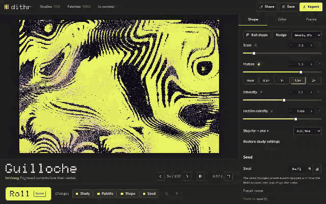
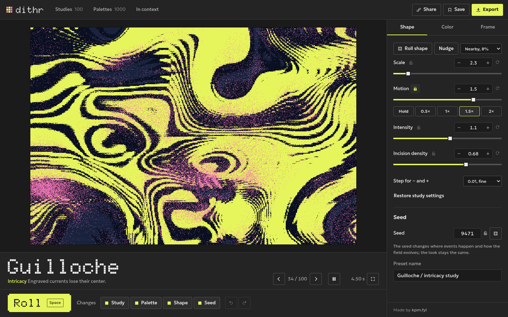
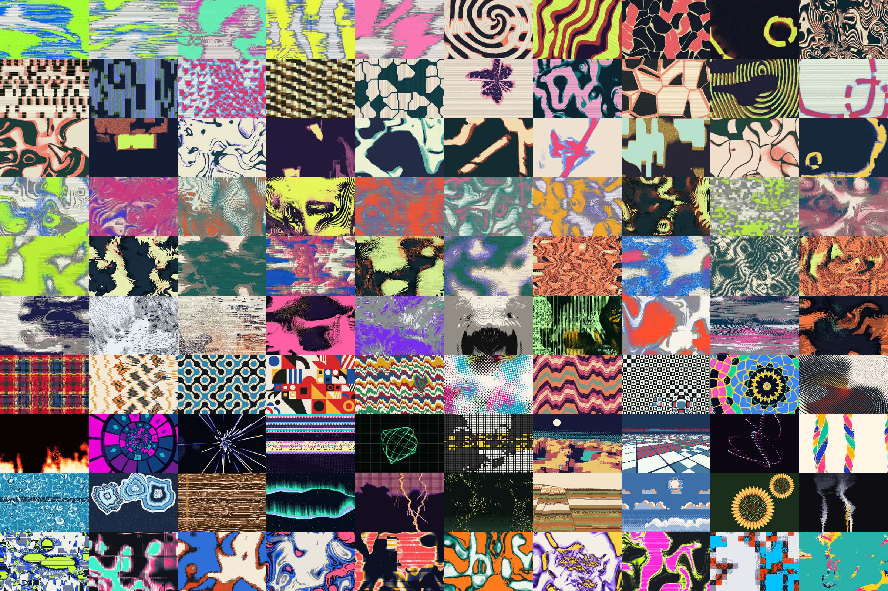
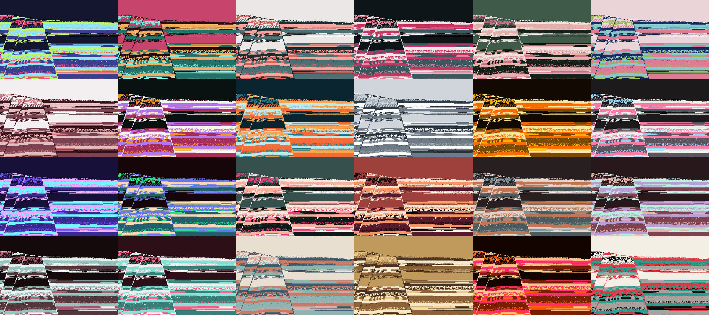
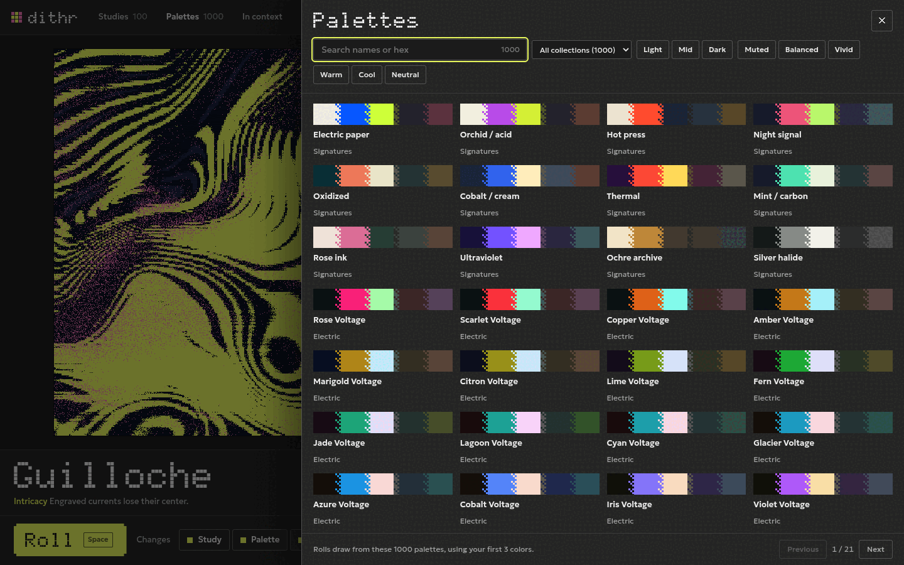
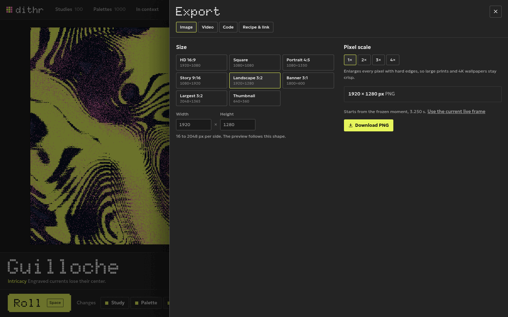
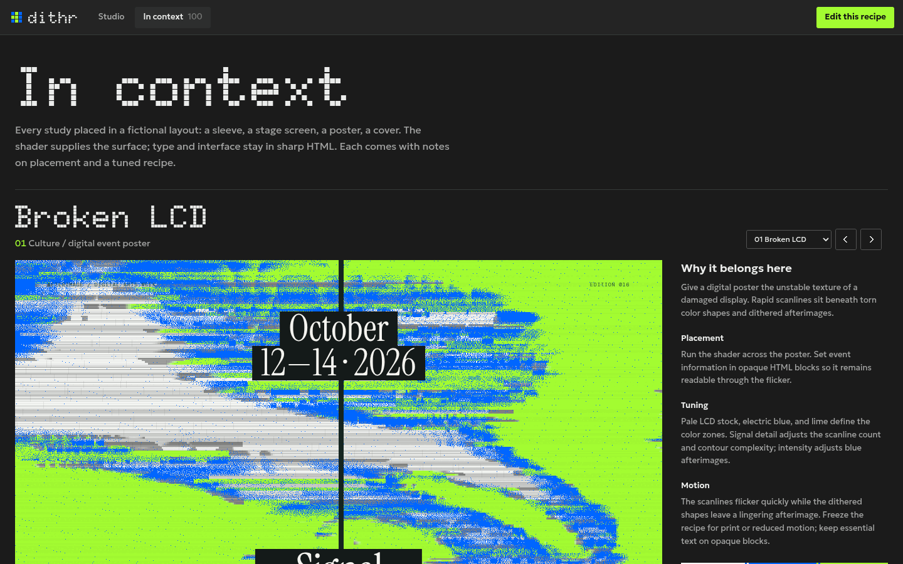

# Dithr

**Make animated pixel-art backgrounds in your browser. Free, no account.**

**[Open the studio →](https://dithr.vaporware.gripe)**



<sub>Ten seconds of use, recorded from the real app. [Watch it as an MP4](docs/images/dithr-reel.mp4).</sub>

Dithr is a pixel-art generator. Press one button to get a moving pattern such as a
glitching screen, woven cloth, liquid metal or a halftone print. Adjust it until it
looks right, then save it as an image, a video, or code you can paste into your own
website. Everything is drawn as crisp, hard-edged pixels.

## What you get

- **100 studies.** Each is a small animated system with its own behavior:
  damaged displays, tide pools, bit-plane glitches, error-diffusion worms, woven
  textiles and more.
- **1000 palettes.** Any study can be painted with any palette, so there are tens
  of thousands of combinations. Use 2 to 5 colors, and edit or lock any of them.
- **Three ways to take it with you.** A PNG up to 8192 px wide, a short video, or
  code (a ready-to-run bundle or a React component).
- **Private by default.** Nothing is uploaded. Saved designs stay in your browser.



## How to use it

1. **Roll.** Press **Roll** (or the Space bar) for a new study, palette, shape and
   seed. The chips beside the button choose what a roll changes, so you can keep a
   study you like and roll only its colors.
2. **Tune.** Use the **Shape** tab for scale, motion, intensity and detail, the
   **Color** tab to edit, lock or rotate colors, and the **Frame** tab to pick an
   aspect ratio. Locked settings stay put when you roll again, and undo covers
   every change.
3. **Export.** Open **Export** to download a PNG, record a video, or copy the code.

The page address always holds your current design, so copying the link shares it or
lets you come back to it later.

## See the range

### All 100 studies

Every study at a glance, in the order they appear in the studio.



### One study, 24 palettes

The same study (Strata) painted with palettes from 12 of the 25 collections.



### Browse and filter palettes

Search by name or hex code, narrow by collection, or filter by feel (light, dark,
muted, vivid, warm, cool). The filtered set is also what palette rolls draw from.



### Export

Pick a size, a pixel scale (1× to 4×, with hard edges so large prints stay crisp),
and download.



### In context

The **[In context](https://dithr.vaporware.gripe/demos)** page places every study in
a sample layout, such as a record sleeve, a stage screen or a magazine cover, with
notes on how to use it.



## Browser support

Works in current Chrome, Edge, Firefox and Safari. It uses WebGPU where available
and falls back to WebGL2. Video export depends on your browser's recording support.

## Run it yourself

Requires Node.js 24+ and npm.

```sh
npm ci
npm run build:consumer
npm run build:export
npm run dev
```

Then open http://127.0.0.1:5187. No account, API key or database is needed.

## Learn more

- [Using Dithr](docs/USAGE.md): running it locally and adding the renderer to your own project
- [Palettes](docs/PALETTES.md): how the library is organized and how to choose colors
- [Developing Dithr](docs/DEVELOPMENT.md): architecture and checks
- [Cloudflare deployment](docs/CLOUDFLARE.md): hosting
- [Contributing](CONTRIBUTING.md): workflow for changes. Run `npm run verify` before submitting.

## License

Original project code is [MIT licensed](LICENSE). Dependencies keep their upstream
licenses; exported code includes both the project license and the Three.js notice.
